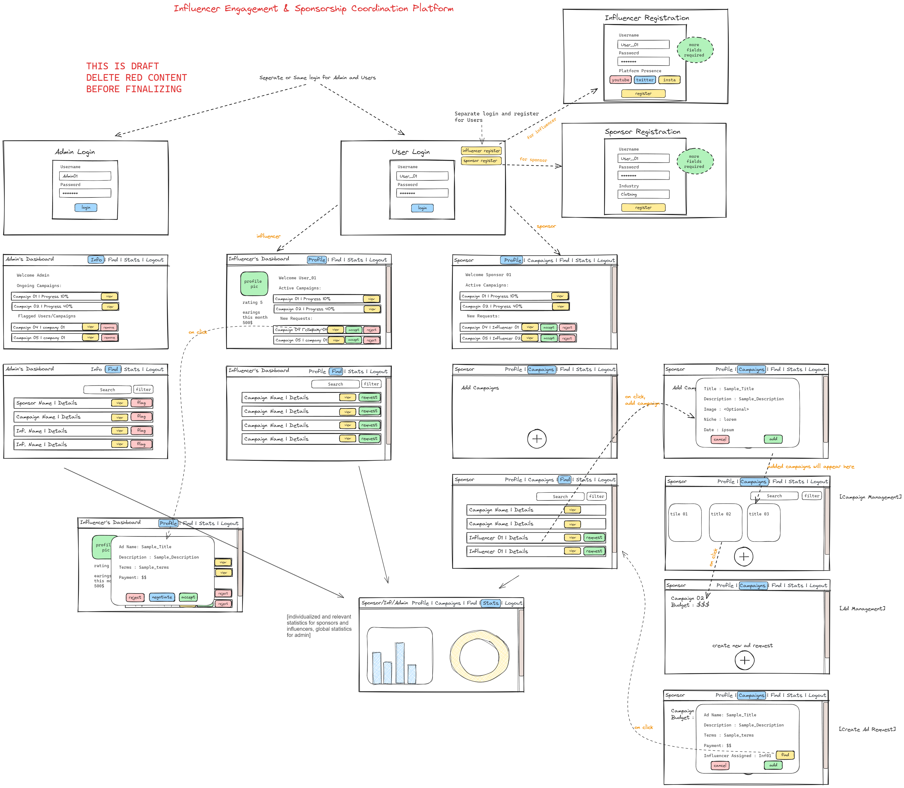

# Modern Application Development II

## Project Statement

**Influencer Engagement & Sponsorship Coordination Platform - V2**  
It's a platform to connect Sponsors and Influencers so that sponsors can get their product/service advertised and influencers can get monetary benefit.

## Frameworks to be used

These are the mandatory frameworks on which the project has to be built:

- **SQLite** for data storage
- **Flask** for API
- **VueJS** for UI
- **VueJS Advanced with CLI** (only if required, not necessary)
- **Jinja2 templates** if required (Not to be used for UI)
- **Bootstrap** for HTML generation and styling (No other CSS framework is allowed)
- **SQLite** for database (No other database is allowed)
- **Redis** for caching
- **Redis and Celery** for batch jobs

> **Note:** All demos should be possible on your local machine.

## Roles

The platform will have three roles:

### Admin - root access

- An admin can monitor all the users/campaigns, see all the statistics
- Ability to flag inappropriate campaigns/users

### Sponsors - a company/individual who wants to advertise their product/service

- Sponsors will create campaigns, search for influencers, and send ad requests for a particular campaign.
- Sponsors can create multiple campaigns and track each individual campaign.
- They can accept ad requests by influencers for public campaigns.
- Each Sponsor may have:
  - Company Name / Individual Name
  - Industry
  - Budget

### Influencers - an individual who has significant social media following

- An influencer will receive ad requests, accept or reject ad requests, negotiate terms, and resend modified ad requests back to sponsors.
- They can search for ongoing campaigns (which are public), according to category, budget, etc., and accept the request.
- An influencer can update their profile page, which is publicly visible.
- Each Influencer profile may have:
  - Name
  - Category
  - Niche
  - Reach (can be calculated by number of followers / activity etc.)

## Terminologies

### Ad request

A contract between campaign and influencer, stating the requirements of the particular advertisement (E.g. show Samsung S23 in 3 videos for 10 seconds each), the amount to be paid, etc.

Ad request may have:

- `campaign_id` (Foreign Key to Campaign table)
- `influencer_id` (Foreign Key to Influencer/user table)
- `messages`
- `requirements`
- `payment_amount`
- `status` (Pending, Accepted, Rejected)

### Campaign

A container for ads requests for a particular goal (E.g. advertisement for Samsung S23). It can have multiple Ad requests, a campaign description, budget, ability to set public or private.

Campaigns may have:

- `name`
- `description`
- `start_date`
- `end_date`
- `budget`
- `visibility` (public, private)
- `goals`

## Application Wireframe

> **Note:** The wireframe is provided only to get the flow of the application and what should appear when a specific user navigates from one page to another. It is NOT mandatory to exactly replicate the views given in the wireframe. Students can work on their own frontend idea.

## Core Functionalities

### 1. Admin login and user login (RBAC)

- A login/register form with fields like username, password, etc. for sponsor, influencer, and admin login.
- The application should have only one admin identified by their role.
- You can either use Flask-Security or JWT-based Token-based authentication to implement role-based access control.
- The app must have a suitable model to store and differentiate all the types of users of the app.

### 2. Admin Dashboard - for the Admin

- The admin should be added automatically whenever a new database is created.
- Every new sponsor signup should be approved by the admin.
- The request should automatically go to the admin’s dashboard for approval.
- The application must have an admin dashboard that displays all the relevant statistics of the application, e.g., active users, campaigns (public/private), ad requests and their status, flagged sponsors/influencers, etc.
- Students can decide what more statistics to show apart from the ones given above.

### 3. Campaign Management - for the sponsors

- Create a new campaign and categorize it into various niches.
- Update an existing campaign - e.g., start_date, end_date, budget, and/or other fields.
- Delete an existing campaign.

### 4. Ad request Management - for the sponsors

- Create ad requests based on the goals of the campaign.
- Edit an existing ad request - e.g., influencer_id, requirements, payment_amount, status.
- Delete an existing ad request.

### 5. Search for influencers, public campaigns

- The sponsors should be able to search for relevant influencers based on their niche, reach, followers, etc.
- The Influencers should be able to search for public campaigns based on their niche, relevance, etc.

### 6. Take action on a particular ad request - for the Influencers

- Ability to view all the ad requests from all the campaigns.
- Ability to accept/reject a particular ad request.
- Ability to negotiate the `payment_amount` for a particular ad.

### 7. Backend Jobs

- **Scheduled Job - Daily reminders:** The application should send daily reminders to influencers on G-Chat using Google Chat Webhooks or SMS or mail.

  - Check if an influencer has not visited/has pending ad requests.
  - If yes, then send the alert asking them to visit/accept the ad request or checkout the public ad requests.
  - The reminder can be sent in the evening, every day (students can choose the time).

- **Scheduled Job - Monthly Activity Report:** Devise a monthly report for the sponsors created using HTML and sent via mail.

  - The activity report can consist of campaign details, how many advertisements were done, growth in sales of products due to campaigns, budget used/remaining, etc.
  - For the monthly report to be sent, start a job on the first day of every month → create a report using the above parameters → send it as an email.

- **User Triggered Async Job - Export as CSV:** Devise a CSV format for details of the campaigns (public/private) created by the sponsor.
  - This export is meant to download the campaign details (description, start_date, end_date, budget, visibility (public, private), goals, etc.).
  - Have a dashboard from where the sponsor can trigger the export.
  - This should trigger a batch job, sending an alert once done.

### 8. Performance and Caching

- Add caching where required to increase the performance.
- Add cache expiry.
- API Performance.

## Recommended Functionalities

- Well-designed PDF reports for Monthly Activity Report (Students can choose between HTML and PDF reports).
- External APIs/libraries for creating charts, e.g., ChartJS.
- Single Responsive UI for both Mobile and Desktop.
- Unified UI that works across devices.
- Add to desktop feature.
- Implement frontend validation on all the form fields using HTML5 form validation or JavaScript.
- Implement backend validation within your APIs.

## Optional Functionalities

- Provide styling and aesthetics to your application by creating a beautiful and responsive frontend using simple CSS or Bootstrap.
- Incorporate a proper login system to prevent unauthorized access to the app using Flask extensions like Flask-Login, Flask-Security, etc.
- Implement a dummy payment portal (just a view taking payment details from sponsors for an ad request).
- Any additional feature you feel is appropriate for the application.

## Evaluation

- Students have to create and submit a project report (not more than 2 pages) on the portal along with the actual project submission.
- The report must include the following things:
  - Student details.
  - Project details, including the question statement and how you approached the problem statement.
  - Frameworks and libraries used.
  - ER diagram of your database, including all the tables and their relations.
  - API resource endpoints (if any).
  - Drive link of the presentation video.
- The project report must be included as a PDF inside the root submission folder and NOT along with it.
- All code is to be submitted on the portal in a single zip file (zipping instructions are given in the project document - Project Doc T22024).
- Students have to create a brief (3–5 minute) video explaining how you approached the problem, what you have implemented, and any extra features.
  - The video must be uploaded to the student drive with access to anyone with the link, and the link must be included in the report.
  - This will be viewed during or before the viva, so it should be a clear explanation of your work.
  - Viva: After the video explanation, you are required to give a demo of your work and answer any questions that the examiner asks.
  - This includes making changes as requested and running the code for a live demo.
  - Other questions that may be unrelated to the project itself but are relevant for the course.

## Instructions

- This is a live document and will be updated with more details (wireframe).
- We will freeze the problem statement on or before 19th May 2024, beyond which any modifications to the statement will be communicated via proper announcements.
- The project has to be submitted as a single zip file.
